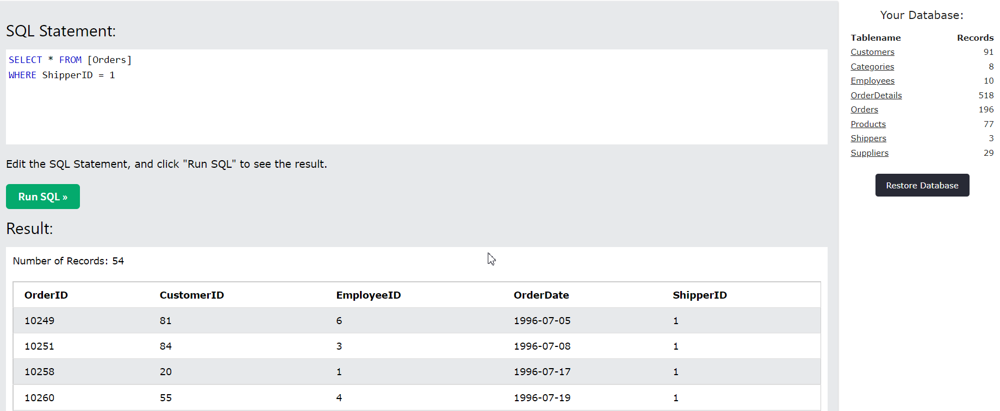
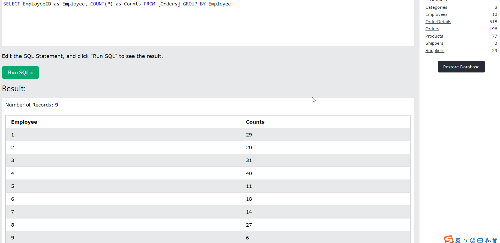
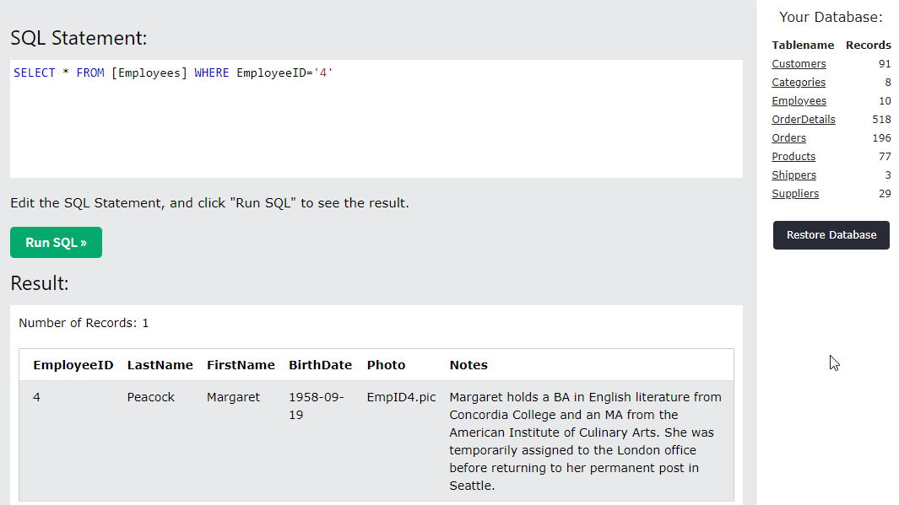

# Challenge Solutions

## Question 1

The solution code is included in "thought_process.py".

### answer a

The original calculation did not conserder the items in each order.

We have two possible methods to evaluate the data.
```python
import numpy as np
import pandas as pd

dframe = pd.read_csv(
    "2019-Winter-Data-Science-Intern-Challenge-Data-Set.csv")


total_items = dframe['total_items'].values
order_amount = dframe['order_amount'].values
```

1. Methon 1: Calculate the price of each sneaker that these shops sell, and then calculate their average. The AOV would be $387.74.
```python
correct_aov = np.mean(np.divide(order_amount, total_items))
print("Correct calculation 1:\t", end="")
print("AOV = {:.2f}".format(correct_aov))
```
2. Method 2: Calculate the sum of all orders, and then divide it by the sum of items of all orders. The AOV would be $357.92.
```python
correct_aov = np.sum(order_amount) / np.sum(total_items)
print("Correct calculation 2:\t", end="")
print("AOV = {:.2f}".format(correct_aov))
```

### answer b

We could know from the data set that:

- There are 100 different shops.
- There are 301 different users.
- There are 3 methods to pay for merchandises, including debit, credit_card, and cash.

Besides, we could describe the price information of different shops using histograms since each shop sells only one model of shoe. 
Notice that there are outliers: one is the shop (id:78) selling expensive sneakers with the price of $25725, the other is the shop (id:42), selling 34063 sneaker items in 51 orders.

Some results are included in the folder "Question1-b".


### answer c

The value is that we could analyze the price of sneakers, the sales volumes, and the total income in different shops. So we would know the consumption level of users and provide users suggestions about similar goods, such as similar prices and so on. We could also provide shops suggestions about what sneakers they should sell, for example, selling too expensive sneakers may not be a good idea.


## Question 2

### instruction

access the data set
```SQL
SELECT * FROM Customers;
```

### answer a

```SQL
SELECT * FROM [Orders]
WHERE ShipperID = 1
```

There are 54 orders shipped by Speedy Express in total.



### answer b

```SQL
SELECT EmployeeID as Employee, COUNT(*) as Counts FROM [Orders] GROUP BY Employee
SELECT * FROM [Employees]
```

The EmployeeID with the most orders is 4, who has 40 orders.
The employee's last name is Peacock and the first name is Margaret.




### answer c

```SQL
SELECT * FROM [Customers] WHERE Country='Germany'
SELECT * FROM [Orders] as a INNER JOIN [Customers] as b on a.CustomerID=b.CustomerID WHERE Country='Germany'

```

Steps:

1. Query and get CustomerIDs who were from Germany, that is `1, 6, 17, 25, 39, 44, 52, 56, 63, 79, 86`.
2. Query and get OrderIDs that were shipped to customers from Germany, that is `10267, 10273, 10277, 10279, 10284, 10285, 10286, 10301, 10312, 10313, 10323, 10325, 10337, 10342, 10343, 10345, 10348, 10356, 10361, 10363, 10391, 10396, 10407, 10418, 10438`.
