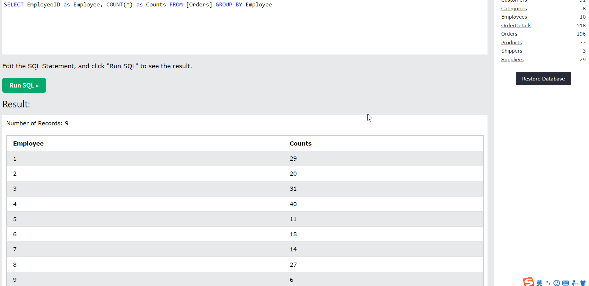

# Challenge Solutions

## Question 1


## Question 2

### instruction

access the data set
```SQL
SELECT * FROM Customers;
```

### answer a

```SQL
SELECT * FROM [Orders]
WHERE ShipperID = 1
```

There are 54 orders shipped by Speedy Express in total.


### answer b

```SQL
SELECT EmployeeID as Employee, COUNT(*) as Counts FROM [Orders] GROUP BY Employee
```

The EmployeeID with the most orders is 4, who has 40 orders.
The employee's last name is Peacock and the first name is Margaret.



### answer c

```SQL

```
